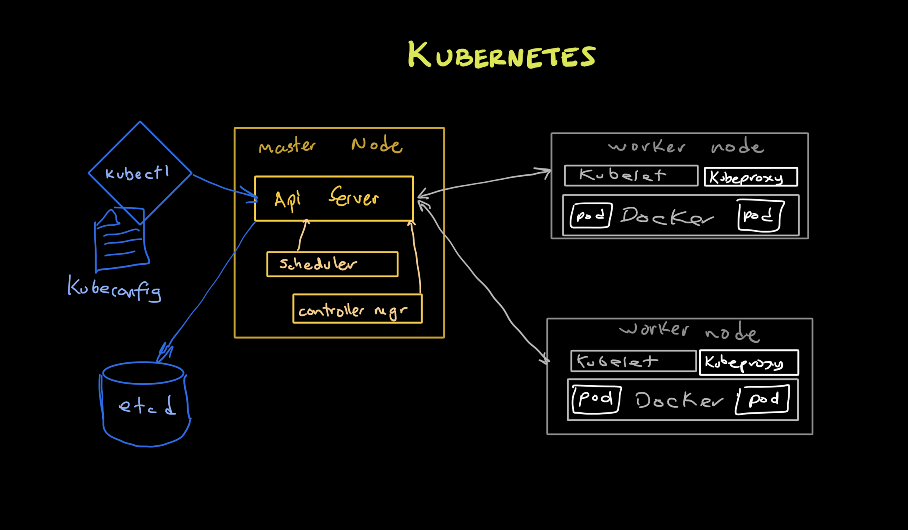
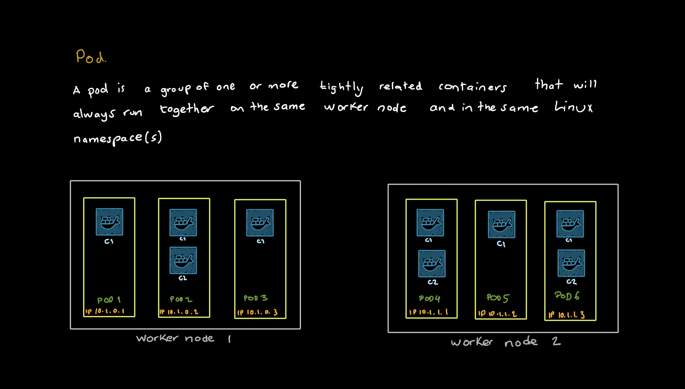
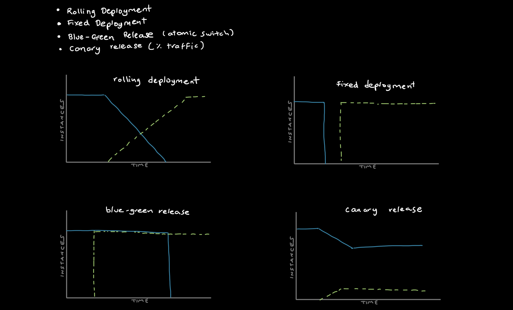
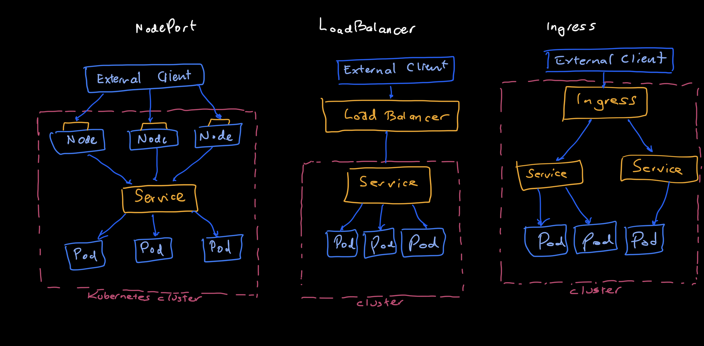

# kubernetes

## Components

**Pod** 

Collections of containers collocated in a single machine

**Service** 

Load balancer that can bring traffic to a collection of pods

**Deployment** 

Replicate a container for availability or scale.

**Kubelet** 

The primary node agent that runs on each node.









## Basic Commands

create deployment:

`kubectl create -f helloworld-pod-with-labels.yml`
  
get pods:

`kubectl get pods`
  
get pods with labels:

`kubectl get pods --show-labels`
  
rename label:

`kubectl label pod/helloworld app=helloworldapp --overwrite`
  
delete label:

`kubectl label pod/helloworld app-`
  
selectors:

```
  kubectl get pods --selector env=production --show-labels
  kubectl get pods --selector dev-lead=jorge,env=staging --show-labels
  kubectl get pods --selector dev-lead!=jorge,env=staging --show-labels
  kubectl get pods -l 'release-version in (1.0,2.0)' --show-labels
```

delete pods with label:

`kubectl delete pods -l dev-lead=jorge`


replace service:

`kubectl replace --force -f commerce.yaml`

deployments:

```
kubectl set image deployments/commerce commerce-app=jorgecontreras/commerce:0.8 --v 6
kubectl rollout history deployments commerce
kubectl describe deployments commerce
kubectl rollout undo deployment commerce --to-revision=2

```

scale:

`kubectl scale --replicas=10 deployment commerce`

(GKE) resize cluster size:

`gcloud container clusters resize monarca --num-nodes=3`

### Imperative approach

```
$ kubectl create namespace ckad
$ kubectl run nginx --image=nginx --restart=Never -n ckad
$ kubectl edit pod/nginx -n ckad
```

### Declarative approach

Suitable for more elaborate changes, version controlled.

```
$ vim niginx-pod.yaml
$ kubectl create -f nginx-pod.yaml
$ kubectl delete pod/nginx
```
### Hybrid approach

```
$ kubectl run nginx --image=nginx --restart=Never --dry-run -o yaml > nginx-pod.yaml
$ vim niginx-pod.yaml
$ kubectl apply -f nginx-pod.yaml
```

# CKAD 

## Core Concepts

### Creating a pod and inspecting it

1. Create the namespace `ckad-prep`

`kubectl create ns ckad-prep`

2. In the namespace `ckad-prep` create a new Pod named `mypod` with the image `nginx:2.3.5`. Expose port 80

`kubectl run mypod --image=nginx:2.3.5 --restart=Never --port=80 -n ckad-prep`

3. Identify the issue with creating the container. Write down the root cause of issue in a file named `pod-error.txt`

`kubectl describe pod mypod -n ckad-prep`

4. Change the image of the Pod to `nginx:1.15.12`

`kubectl edit pod mypod -n ckad-prep`

5. List the Pod and ensure that the container is running

`kubectl get pods -n ckad-prep`

6. Log into the container and run the `ls` command. Write down the output. Logout of the container.

`kubectl exec mypod -it -n ckad-prep -- /bin/sh`

7. Retrieve the IP address of the Pod `mypod`

`kubectl get pods -n ckad-prep -o wide`

8. Run a temporary Pod using the image `busybox`, shell into it and run a `wget` command against the `nginx` Pod using port 80

`kubectl run busybox --image=busybox --restart=Never --rm -it -- wget -O- <NGINX-POD-IP>:80`

9. Render the logs of Pod `mypod`

`kubectl logs mypod -n ckad-prep`

10. Delete the Pod and the namespace

`kubectl delete ns ckad-prep`


### ConfigMaps

1. Create a new file named config.txt with the following environment variables as key/value pairs on each line.
- DB_URL localhost:3306
- DB_USERNAME postgres

`vim config.txt`

2. Create a new ConfigMap named db-config from that file

`kubectl create configmap db-config --from-env-file=config.txt`

3. Create a Pod names backend that uses the environment variables from the ConfigMap and runs the container with the image nginx

`kubectl run backend --image=nginx --restart=Never -o yaml --dry-run=client > backend.yaml`

`vim backend.yaml`

Insert the envFrom section:

```
envFrom:
    - configMapRef:
        name: db-config
```

`kubectl create -f backend.yaml`

4. Shell into the Pod and print out the created environment variables. You should find DB_URL and DB_USERNAME with their appropriate values.

`kubectl exec backend -it -- /bin/sh`

`$ env`

## Configuring a Pod to use a secret

1. Create a new secret named db-credentials with the key/value pair db-password=passwd

`kubectl create secret generic db-credentials --from-literal=db-password=passwd`

2. Create a Pod named backend that uses the Secret as environment variable named DB_PASSWORD and runs the container with the image nginx

`kubectl run backend --image=nginx --restart=Never --dry-run=client -o yaml > backend.yaml`

`vim backend.yaml`

```
env:
      - name: DB_PASSWORD
        valueFrom:
          secretKeyRef:
            name: db-credentials
            key: db-password
```

3. Shell into the Pod and print out the created environment variables. you should find DB_PASSWORD variable.

`kubectl exec -it backend -- /bin/sh`

`env`
