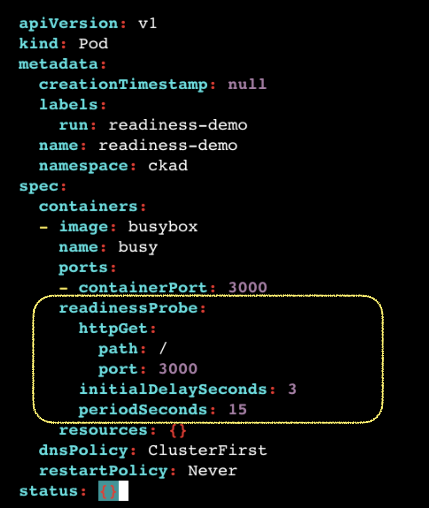

# Probes

**Probes** are used to monitor the health and readiness of containers in a Pod. 



## Types of Probes

1. **Liveness Probe**:
   - Checks if the container is still running.
   - If the probe fails, the container is restarted.

2. **Readiness Probe**:
   - Checks if the container is ready to serve traffic.
   - Pods with failing readiness probes are excluded from Services.

3. **Startup Probe**:
   - Ensures that a slow-starting application is fully initialized before other probes are run.

---

## Probe Configuration

HTTP probe

```yaml
livenessProbe:
    httpGet:
        path: /health
        port: 8080
    initialDelaySeconds: 5
    periodSeconds: 10
```

TCP probe

```yaml
readinessProbe:
  tcpSocket:
    port: 8080
  initialDelaySeconds: 5
  periodSeconds: 10
```

command probe

```yaml
startupProbe:
  exec:
    command:
      - cat
      - /tmp/ready
  initialDelaySeconds: 5
  periodSeconds: 10
```